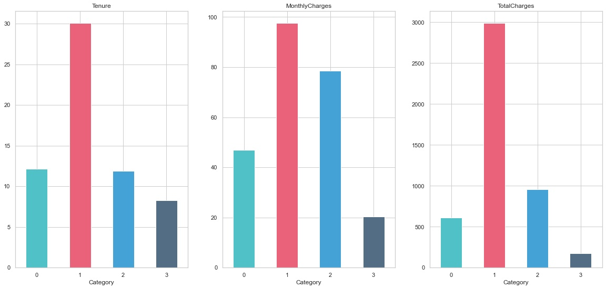
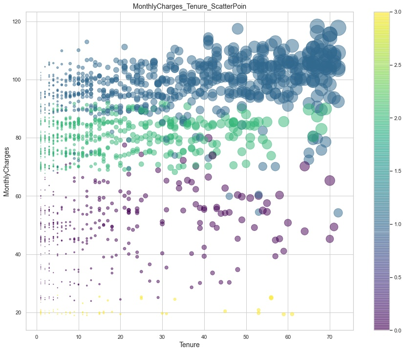
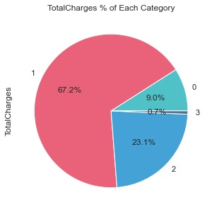

Telco_Customer_Churn_Data_Analysis

电信企业客户流失数据分析报告
- [相关背景与分析目的](#相关背景与分析目的)
- [结论](#结论)
  - [结合用户生命周期进行分析原因与可能的解决措施](#结合用户生命周期进行分析原因与可能的解决措施)
  - [用户个人特征对流失率的影响](#用户个人特征对流失率的影响)
  - [网络服务提供情况对流失率的影响](#网络服务提供情况对流失率的影响)
- [数据情况](#数据情况)
  - [数据集概览](#数据集概览)
  - [数据基本分析](#数据基本分析)
  - [流失率与其他变量之间的关系](#流失率与其他变量之间的关系)
  - [用户流失数据情况拆分](#用户流失数据情况拆分)
    - [用户分类](#用户分类)
      - [按用户使用服务时间划分](#按用户使用服务时间划分)
      - [根据用户行为数据使用聚类模型细分流失用户群体](#根据用户行为数据使用聚类模型细分流失用户群体)
- [分类器模型](#分类器模型)
  - [分类器信息](#分类器信息)
- [完整代码](#完整代码)

# 相关背景与分析目的
根据网络服务电信企业给定的用户服务数据集，分析用户流失的主要原因并给出针对性的解决措施以降低用户流失率。

# 结论
## 结合用户生命周期进行分析原因与可能的解决措施

|序号|用户类别|数量|平均使用时长|平均月度消费|定性特征|重要程度|
|----|--------|----|------------|-----------|:------:|--------|
|0   |一类用户|422|12.11月|46.84|平均使用时长``1年左右``，月度消费额较低，这意味着这类别用户趋向于``选择较低的月度消费``，也就是选择``数量更少，价格更低``的网络及更少的其他服务|0.9|
|1   |二类用户|644|30.05月|97.52|平均使用时长最长，``接近2.5年``，月度消费最高，这表示这类用户愿意选择最``优质的网络``及更多的增值服务|6.7|
|2   |三类用户|690|11.90月|78.64|平均使用时间同样在``1年左右``，有次高的月度消费额，仅稍低于二类用户，这类用户倾向于选择较优质，数量较多的服务，但会有所保留|2.3|
|3   |四类用户|113|8.24月|20.37|平均使用时长最短，``8个月左右``，有远低于其他类别用户的月度消费，此类用户对网络服务的需求水平较低，可能仅需要最基础的网络服务功能加少量的其他低价服务|.07|

  + 二类用户：探索期->成熟期 - 高级价值用户
    + 此类用户平均使用时长接近30个月，根据用户生命周期划分可以划分为成熟期，用户对网络公司提供的各项服务已经有了相当的熟悉程度。此外，二类用户的平均消费水平是最高的，对公司的营收贡献在所有流失用户中占比最大，达67%。此类用户的有较大的用户流粘性，但也可能会流失，最重要的是预防流失。
    + 措施：建立流失壁垒
      + 1. 建立特权体系
           + 为高价值用户提供专属的加值服务，比如使用总时间/月度消费达到XX后可以获得``"7*24小时专属客服与节假日风雨无阻特快上门维修"``  ，让高价值用户的使用体验得到提升，并且能获得更高水平/有差异性的身份认证与待遇。
        1. 搭建友好关系
  + 三类用户：新手期 - 中等价值用户
    + 三类用户的平均使用时间较短，只有11.9月，我们将其划分为新手期，用户对公司的服务有了一定的了解。此外，该类用户的消费意愿/水平较高，愿意使用更优质/更多数量的网络服务，但平均使用时间不到一年便流失了，考虑可能的原因有如下几点：
      + 1. 用户在这接近一年的时间内对公司提供的网络服务已经有了较为全面的体验，此时流失可能是由于网络服务使用体验不及预期或性价比较低。
        2. 这一阶段的用户粘性还处于较低的水平，此时同行业竞品如果提供性价比更高，更优惠的价格进行拉新，极易让这些处于流失边际的用户被撬动。
  + 一类用户：体验期->新手期 - 次低价值用户
    + 一类用户的平均使用时间接近一年，我们将其划分为体验期与新手期。这类用户的消费意愿/消费水平较低，愿意使用基础的网络服务加少量的增值服务。可能的流失原因与三类用户相似。
  + 四类用户：体验期 - 最低价值用户
    + 四类用户的平均使用时间仅为8个月，考虑他们的合同签约方式基本为``Month-To-Month``，此外，他们的消费金额只略高于最低消费水平。原因分析：
      + 体验期的用户流失率会比较高，主要是由于新进来的用户质量普遍较低，如果是通过价格战、补贴、抽奖等短期利益诱导发展来的客户就更容易流失，因为这类用户的动机在于占便宜/获利，而不是认可公司的服务本身，这时候我们需要重新评估相应的拉新渠道和拉新策略是否合理，是否需要调整。

## 用户个人特征对流失率的影响
+ 退休用户的流失率为42%，远高于未退休用户的24%
+ 针对这一现象，可以考虑可能的原因有以下几点：
  + 1. 公司的网络服务使用体验对老年人不够友好，可能涵盖较复杂的/相当一部分老年人操作起来困难的过程，这降低了他们对产品的粘性
    1. 公司对老年人的售后服务可能存在一定的问题，比如客服答疑无法帮助老年人快速解决问题
    2. 公司缺乏针对客户中的老年群体的增加粘性的营销活动，如果有，那可能存在定位偏差，对老年群体的真正诉求没有深入的理解

## 网络服务提供情况对流失率的影响
 1. TechSupport技术支持：未购买
    + 技术支持服务是用户遇到问题时的产品体验保障，考虑到未购买技术支持服务的用户更可能会流失，公司在前端销售的过程中可以将推动用户购买技术支持服务的重要性提高，适当得降低价格或添加捆绑营销，尽可能得提高用户使用技术支持服务的比例以降低流失率
 2. OnlineBackup线上备份：未购买
 3. StreamingMovies串流媒体：未购买
 4. OnlineSecurity线上安全：未购买
+ 对于以上更可能推动用户流失的因素，公司应推动用户购买相应服务，同时可以尝试进行一段时期的免费试用来提升用户粘性。
 5. InternetServices网络服务：FIberOptic 光纤
    + 光纤用户的流失率更高，考虑光纤的价格与使用体验会优于DSL数字用户先，这类客户的需求与消费能力更高。可能的原因：
      + 公司提供的光纤服务使用体验较差/性价比较低，与同类竞品相比存在劣势

# 数据情况
## 数据集概览
+ 数据集规模: (7032, 21)
  
+ 数据集特征涵盖以下内容
  +  用户个人信息
     +  性别，是否退休，是否有配偶，是否有监护人
  +  用户账户情况
     +  支付方式，月度消费，总消费，合约类型，使用时长，是否流失
  +  用户使用的服务类别

+ 缺失值情况与处理：共11行缺失总消费金额，删去涵盖缺失值的行

## 数据基本分析
+ 用户使用公司服务的时间分布情况
  + 横坐标：用户使用时长(月)，纵坐标：用户数(户)
  + 整体呈双峰分布，使用1-3个月的用户人数最多，超过1200户，使用35-45个月的用户数最少，使用67-70个月及以上的用户较多，接近800户。

+ 用户使用公司服务签订的合同类型对应的用户使用时长分布
  + 按月签订合约的用户最多，为3875户，按一年/两年签订合约的用户为1685/1472户

+ 各项服务的使用情况

+ 用户个人信息基本统计：
  + 性别：男性50.5% 女性49.5%
  + 是否退休：未退休：83.8% 退休：16.2%
  + 配偶情况：无配偶：51.7% 有配偶：48.3%
  + 监护人情况：无监护人：70.2% 有监护人：29.8%

+ 给定数据集中的总用户流失率为26.6%

## 流失率与其他变量之间的关系
+ 用户流失情况与服务使用时间的关系
  + 流失用户的使用时长主要集中在1-30个月内，平均时长10月左右，未流失用户的使用时长范围更广，平均时长38月左右

+ 不同合同类型对应的流失率情况
  + 按月付费的合同流失率最高，为43%，而按一年和两年签订合约的流失率分别为11%和3%

+ 退休情况与流失率之间的关系
  + 退休用户的流失率为42%，远高于未退休用户的24%
  + 针对这一现象，可以考虑可能的原因有以下几点：
    + 1. 公司的网络服务使用体验对老年人不够友好，可能涵盖较复杂的/相当一部分老年人操作起来困难的过程，这降低了他们对产品的粘性
      2. 公司对老年人的售后服务可能存在一定的问题，比如客服答疑无法帮助老年人快速解决问题
      3. 公司缺乏针对客户中的老年群体的增加粘性的营销活动，如果有，那可能存在定位偏差，对老年群体的真正诉求没有深入的理解

+ 月度收费与流失率之间的关系
  + 更高的月度收费通常伴随着较高的流失率

+ 月度消费的最高值为118.35，可以理解为此用户几乎选择了公司提供的最优质、数量最多的服务。而最低值为18.85.

+ 总收费与流失率之间的关系

## 用户流失数据情况拆分

### 用户分类
#### 按用户使用服务时间划分
通过产品本身的特性以及用户使用时间分布情况，得出以下用户生命周期规划
+ 新用户I - 体验期 （1-6月）
+ 新用户II - 新手期 （7-24月）
+ 老用户I -  探索期  （25-50月）
+ 老用户II -  成熟期 （51月及以上）

|用户类别|用户使用期限|流失数量|留存数量|总数量|流失率|
|--------|--------|--------|--------|--------|--------|
|新用户I|1-6个月|784|686|1470|53.3%|
|新用户II|7-24个月|547|1182|1729|31.6%|
|老用户I|25-50个月|350|1378|1728|20.2%|
|老用户II|51个月及以上|188|1917|2105|8.9%|

+ 不同用户类别对应的基础信息情况：较为均衡

+ 不同用户类别对应的月度消费金额最小值/平均值/最大值
  + 按使用时间分类的用户类别月度消费金额呈逐步上升的趋势

#### 根据用户行为数据使用聚类模型细分流失用户群体
+ 模型
  + 特征：用户使用的网络服务与交易方式，合约类型
  + KMeans
  + 簇数：4

+ 模型分类后各类别用户的数量

+ 各类别用户的平均使用时长，平均月度消费金额与平均总消费金额
  
  
+ 各类别用户的分布情况，颜色代表类别，尺寸代表总消费金额

  
  
+ 接下来，依据各类别用户的使用时长，平均月度消费金额，平均总消费金额进行定性归类

+ 此外，根据四种类别用户对应的总收入占比定义客户的重要程度
  + 四类客户提供的总收入贡献占比
    

|序号|用户类别|数量|平均使用时长|平均月度消费|定性特征|重要程度|
|----|--------|----|------------|-----------|:------:|--------|
|0   |一类用户|422|12.11月|46.84|平均使用时长``1年左右``，月度消费额较低，这意味着这类别用户趋向于``选择较低的月度消费``，也就是选择``数量更少，价格更低``的网络及更少的其他服务|0.9|
|1   |二类用户|644|30.05月|97.52|平均使用时长最长，``接近2.5年``，月度消费最高，这表示这类用户愿意选择最``优质的网络``及更多的增值服务|6.7|
|2   |三类用户|690|11.90月|78.64|平均使用时间同样在``1年左右``，有次高的月度消费额，仅稍低于二类用户，这类用户倾向于选择较优质，数量较多的服务，但会有所保留|2.3|
|3   |四类用户|113|8.24月|20.37|平均使用时长最短，``8个月左右``，有远低于其他类别用户的月度消费，此类用户对网络服务的需求水平较低，可能仅需要最基础的网络服务功能加少量的其他低价服务|.07|

# 分类器模型

## 分类器信息

+ 模型：LightGBM
  + 使用特征列：用户基础信息，用户购买的网络服务项目与购买行为数据
+ 模型评估
  + AUC: 0.81
  + Accuracy: 0.73
  + Confusion Matrix

+ Important Features

+ 重要性程度较大的因素 (>0.4)：
  + 1. PaymentMethod支付类型：使用电子支票
    2. TechSupport技术支持：未购买
       + 技术支持服务是用户遇到问题时的产品体验保障，考虑到未购买技术支持服务的用户更可能会流失，公司在前端销售的过程中可以将推动用户购买技术支持服务的重要性提高，适当得降低价格或添加捆绑营销，尽可能得提高用户使用技术支持服务的比例以降低流失率
    3. OnlineBackup线上备份：未购买
    4. StreamingMovies串流媒体：未购买
    5. OnlineSecurity线上安全：未购买
       + 对于以上更可能推动用户流失的因素，公司应推动用户购买相应服务，同时可以尝试进行一段时期的免费试用来提升用户粘性。
    6. InternetServices网络服务：FIberOptic 光纤
       + 光纤用户的流失率更高，考虑光纤的价格与使用体验会优于DSL数字用户先，这类客户的需求与消费能力更高。可能的原因：
         + 公司提供的光纤服务使用体验较差/性价比较低，与同类竞品相比存在劣势

# 完整代码

[完整代码链接在此](code/Data_Clean_EDA.ipynb)

